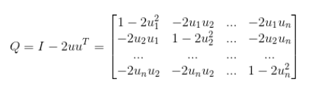
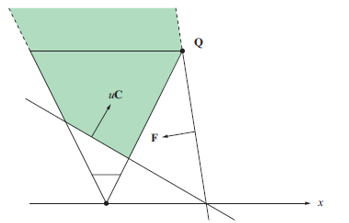
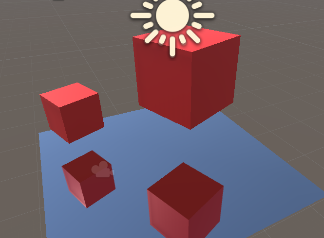
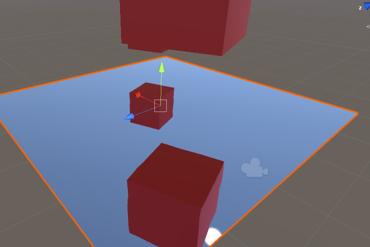
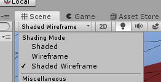
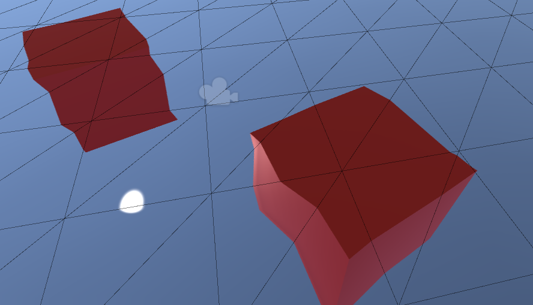
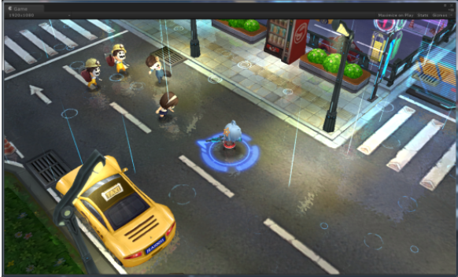
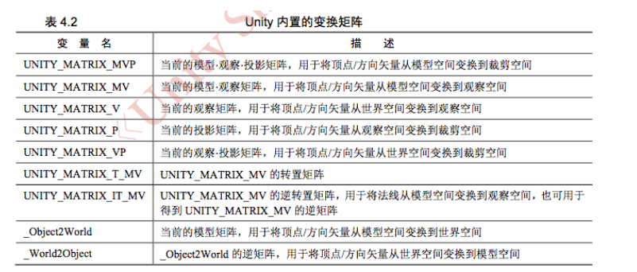

## Mirror Shader


### 打开镜像世界

我们在Unity里打开镜像的世界呢，原理很简单，
我们再加一个Mirror Camera就可以了，其位置是我们当前Camera相对于镜面的一个镜像的映射（Transform）。

1. 镜像矩阵

这个概念比较复杂，记公式就可以了。



有了公式，代码就好写了
```csharp
   public static void CalculateReflectionMatrix(ref Matrix4x4 reflectionMat, Vector4 plane)
    {
        reflectionMat.m00 = (1F - 2F * plane[0] * plane[0]);
        reflectionMat.m01 = (-2F * plane[0] * plane[1]);
        reflectionMat.m02 = (-2F * plane[0] * plane[2]);
        reflectionMat.m03 = (-2F * plane[0] * plane[3]);

        reflectionMat.m10 = (-2F * plane[1] * plane[0]);
        reflectionMat.m11 = (1F - 2F * plane[1] * plane[1]);
        reflectionMat.m12 = (-2F * plane[1] * plane[2]);
        reflectionMat.m13 = (-2F * plane[1] * plane[3]);

        reflectionMat.m20 = (-2F * plane[2] * plane[0]);
        reflectionMat.m21 = (-2F * plane[2] * plane[1]);
        reflectionMat.m22 = (1F - 2F * plane[2] * plane[2]);
        reflectionMat.m23 = (-2F * plane[2] * plane[3]);

        reflectionMat.m30 = 0F;
        reflectionMat.m31 = 0F;
        reflectionMat.m32 = 0F;
        reflectionMat.m33 = 1F;
    }

```

2. 然后是把MirrorCamera放到镜像的点，同时修改以下属性，设置其变换矩阵：
`reflectionCamera.worldToCameraMatrix = cam.worldToCameraMatrix * reflection;`

3. 剪切矩阵
我们要把MirrorCamera与镜面间的内容剪切掉。


4. 



Unity的Camera直接有方法，但这里用的还是公式，如下链接说的很详细，不再多说了。
https://www.jianshu.com/p/15dea7f9e50f

代码如下：
```csharp
    public static void CalculateObliqueMatrix(ref Matrix4x4 projection, Vector4 clipPlane)
    {
        Vector4 q = projection.inverse * new Vector4(sgn(clipPlane.x), sgn(clipPlane.y), 1.0f, 1.0f);
        Vector4 c = clipPlane * (2.0F / (Vector4.Dot(clipPlane, q)));
        projection[2] = c.x - projection[3];
        projection[6] = c.y - projection[7];
        projection[10] = c.z - projection[11];
        projection[14] = c.w - projection[15];
    }

```

### Mirror Shader

获取MirrorCamera的RenderTarget，即MirrorCamera的截图效果。

```c
	inline float4 ComputeNonStereoScreenPos1(float4 pos) {
		float4 o = pos * 0.5f;
		o.xy = float2(o.x, o.y * _ProjectionParams.x) + o.w;
		o.zw = pos.zw;
		return o;
	}
```
以上Unity Shader 库中定义的ComputeScreenPos的内部实现。

之后使用tex2Dproj方法进行纹理采样。

`fixed4 refl = tex2Dproj(_ReflectionTex, UNITY_PROJ_COORD(i.refl));`



其中
`uniform float4 _ProjectionParams;`

投影参数各值分别为如下含义：
- x： = 1,如果投影翻转则x = -1
- y：是camera近裁剪平面
- z：是camera远裁剪平面
- w：是1/远裁剪平面


```c
    inline float4 ComputeScreenPos1(float4 pos, float d) {
        float4 o = pos *0.5f;
        o.xy = float2(o.x / d, o.y / d * _ProjectionParams.x) + 0.5f;
        //o.xy = float2(o.x / o.w, o.y / o.w * 1) + 0.5f;
        o.zw = pos.zw;
        return o;
    }
```

使用如下进行纹理采样：

`fixed4 refl = tex2D(_ReflectionTex, i.refl.xy);`

效果如下：



可以看到采样的有抖动的问题。

打开Wireframe



如下图：我们就可以看到其中的规律了。



如果使用tex2D函数进行采样，如果纹理贴图与面有拉抻的情况。那样就会出现不规则、不确定的贴图采样扭曲的现象，这就是为什么使用 `tex2Dproj` 的原因了。

最后看一些`UNITY_PROJ_COORD` 的定义，大多数平台上其值是与输入值一样的。
```c
#if defined(SHADER_API_PSP2)
#define UNITY_BUGGY_TEX2DPROJ4
#define UNITY_PROJ_COORD(a) (a).xyw
#else
#define UNITY_PROJ_COORD(a) a
#endif
```


### 后续处理

uv扰动参数和噪声贴图


这里还要说明一种深度模糊的效果


## 附录：

1. `uniform float4 _ScreenParams` 屏幕参数：
- x = 屏幕宽度
- y = 屏幕高度
- z =  1 + 1.0/屏幕宽度
- w = 1 + 1.0/height屏幕高度(指像素数)

2. Unity内置变换矩阵



3. Githup 源码位置


