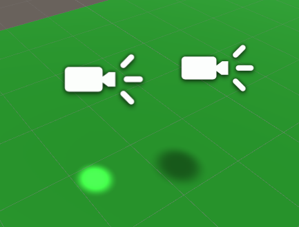
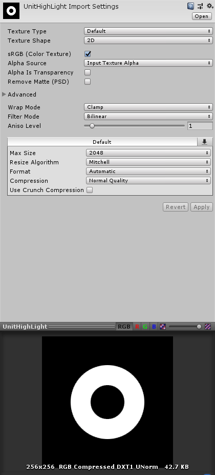

# Projector Shader 

通过Projector 实现阴影与聚光灯的效果


## 插件
5.6之前还是从Sample 工程中进行安装。新版本2019之后，不知道去哪下载了。


## 代码

```js
// Upgrade NOTE: replaced 'mul(UNITY_MATRIX_MVP,*)' with 'UnityObjectToClipPos(*)'

// Upgrade NOTE: replaced '_Projector' with 'unity_Projector'
// Upgrade NOTE: replaced '_ProjectorClip' with 'unity_ProjectorClip'

Shader "Projector/Light" {
	Properties {
		_Color ("Main Color", Color) = (1,1,1,1)
		_ShadowTex ("Cookie", 2D) = "" {}
		_FalloffTex ("FallOff", 2D) = "" {}
	}
	
	Subshader {
		Tags {"Queue"="Transparent"}
		Pass {
			ZWrite Off
			ColorMask RGB
			Blend DstColor One
			Offset -1, -1
	
			CGPROGRAM
			#pragma vertex vert
			#pragma fragment frag
			#pragma multi_compile_fog
			#include "UnityCG.cginc"
			
			struct v2f {
				float4 uvShadow : TEXCOORD0;
				float4 uvFalloff : TEXCOORD1;
				UNITY_FOG_COORDS(2)
				float4 pos : SV_POSITION;
			};
			
			float4x4 unity_Projector;
			float4x4 unity_ProjectorClip;
			
			v2f vert (float4 vertex : POSITION)
			{
				v2f o;
				o.pos = UnityObjectToClipPos (vertex);
				o.uvShadow = mul (unity_Projector, vertex);
				o.uvFalloff = mul (unity_ProjectorClip, vertex);
				UNITY_TRANSFER_FOG(o,o.pos);
				return o;
			}
			
			fixed4 _Color;
			sampler2D _ShadowTex;
			sampler2D _FalloffTex;
			
			fixed4 frag (v2f i) : SV_Target
			{
				fixed4 texS = tex2Dproj (_ShadowTex, UNITY_PROJ_COORD(i.uvShadow));
				texS.rgb *= _Color.rgb;
				texS.a = 1.0-texS.a;
	
				fixed4 texF = tex2Dproj (_FalloffTex, UNITY_PROJ_COORD(i.uvFalloff));
				fixed4 res = texS * texF.a;

				UNITY_APPLY_FOG_COLOR(i.fogCoord, res, fixed4(0,0,0,0));
				return res;
			}
			ENDCG
		}
	}
}

```


## 效果如下：



## 其它效果
1. 做人物下面的选择效果

2. 技能在地面上的效果
   