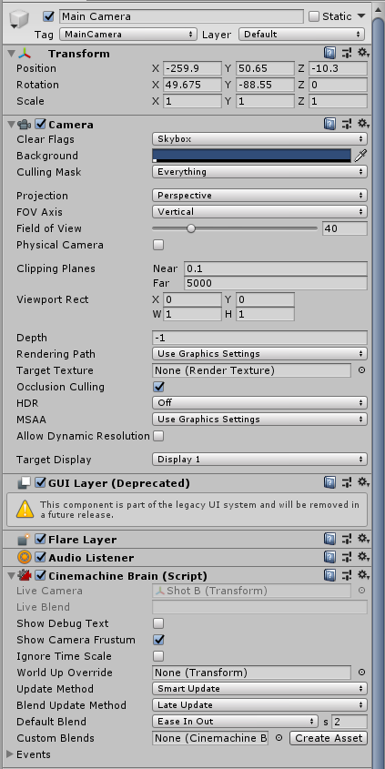
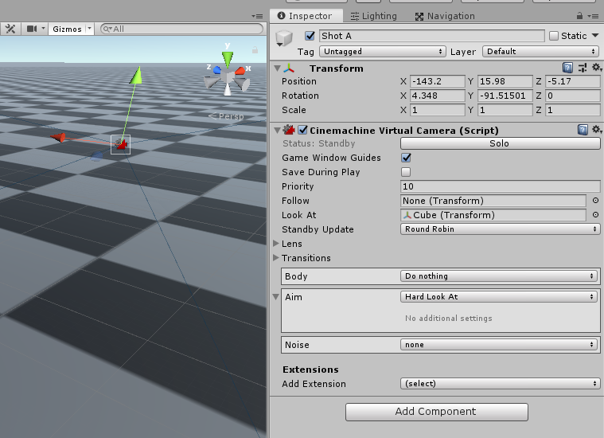
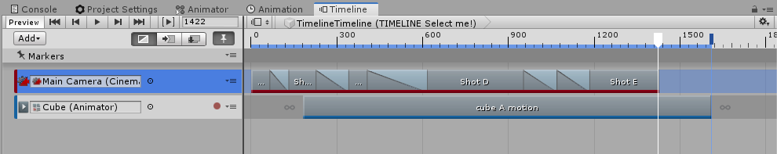
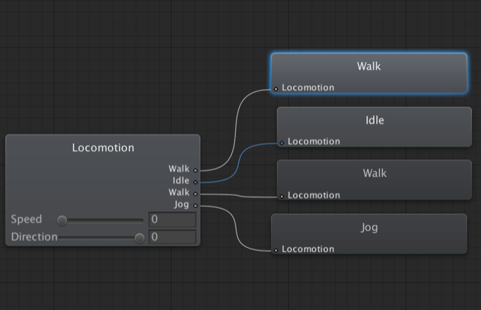
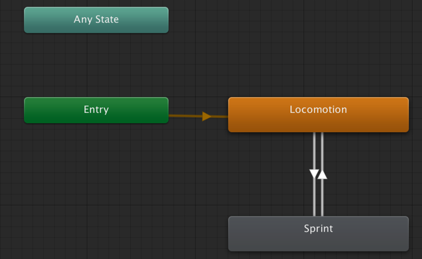

# CinemaChine

## 原理

1. 在一个原始Camera上追加 CinemaChineBrain 脚本

2. 定义虚拟Camera

3. Timeline

定义多个虚拟Camera之后，追加Timeline的CinemaChine Slot，可以在多个机位之间进行切换。

4. 状态机 Brain

其中的State是对应Animator中定义的
支持父子状态

