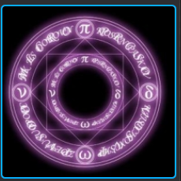

# Skill

## 群体技能 

选择一个区域后，释放天雷，每秒内对区域内对方单元造成40%法术伤害，持续3秒，之后随机对区域内对方单元实施天雷咒，降低防御力30%，持续5秒。

可以使用如下的法阵
https://www.element3ds.com/plugin.php?id=imagekoo:index&mod=list&first=2&second=530&third=559

扩展：
天雷或可换成火球，这一使用Collider就可以了。

分步：

1. 选择技能，有切换技能动作。

2. 选择区域
 - World也要支持Mouse Move事件。
 - UI上支持取消区域。
 - 

##　物理技能

刀剑等带有剑风等拖尾效果

## 特写镜头

使用的辅助镜头用于展示技能的细节与动态效果
通过CinemaChine插件，定义不同的机位，来进行特写的拍摄。

1. 
